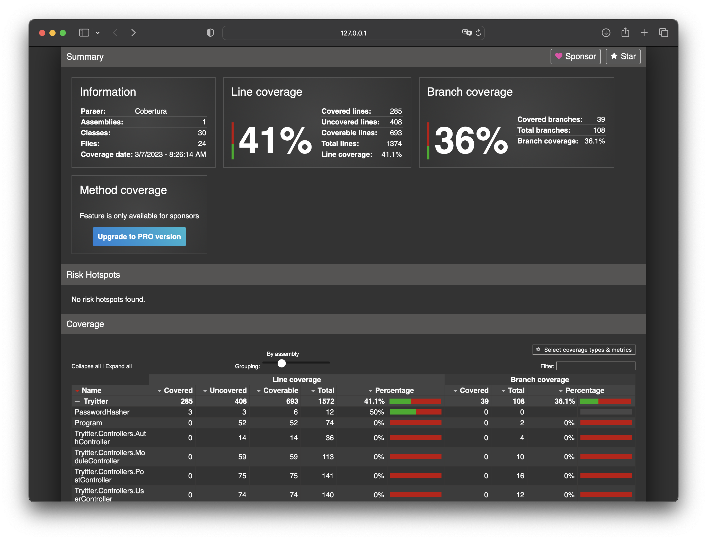

# Tryitter :bird:

Este é o desafio final do curso de Aceleração em C# desenvolvido por [Raphael Martins](https://github.com/raphaelalmeidamartins).

Desenvolvemos uma API para uma rede social estilo Twitter para pessoas estudantes da Trybe.

## Ferramentas :wrench:

- ASP .NET Core
- Entity Framework
- Microsoft SQL Server
- Docker
- JSON Web Tokens

## Recursos :sparkles:

- Cadastrar Usuário
- Atualizar informações de usuário
- Seguir e deixar de seguir outros usuários
- Criar publicações no estilo de Tweets (com no máximo 300 caracteres)

## Metodologias e Design Patterns :pencil2:

- Code First
- Reposiroty Pattern
- Data Transfer Objects (Dtos)
- Princípios de SOLID

## Como executar a aplicação :computer:

Para executar, é necessário que você tenha instalado na sua máquina, o **.NET 6.0**, a **dotnet-cli** e a **dotnet ef cli**. Caso opte pela utilização do container para o banco de dados, também é necessário que você tenha o Docker na versão **20.10.22** (ou superior) e o Docker Compose na versão **2.15.1** (ou superio).

### 1 - Clone o repositório e entre na pasta da aplicação

```sh
git clone git@github.com:raphaelalmeidamartins/Tryitter.git && cd Tryitter/src
```

### 2 - Suba o container do banco de dados

Observação: caso prefira se conectar com uma instância local na sua mâquina, pule esta etapa.

```sh
docker-compose up -d
```

### 3 - Acessa a pasta do projeto e instale as dependências

```sh
cd Tryitter && dotnet restore
```

### 4 - Gere o schema do banco de dados

Observação: caso tenha pulado a etapa 2 (de subir o container), altere a string de conexão `Tryitter_DB` localizada no `appsettings.json`com as credenciais do seu banco antes de executar o comando a baixo.

```sh
dotnet ef database update; 
```

O comando acima criará a database Tryitter e as respectivas tabelas.

### 5 - Execute a aplicação

Dentro da pasta do projeto, execute:

```sh
dotnet run
```

## Credenciais :key:

Ao ser executada, a aplicação populará automaticamente a tabela Modules com os módulos presentes no curso da Trybe e também criará a pessoa usuária administradora.

- **Username:** admin
- **Password:** admin

Algumas rotas só podem ser acessadas pela pessoa administradora, enquanto outras podem ser acessados pelas pesoas usuárias regulares.

## Testes :test_tube:

Para executar os testes, navegue até a pasta Trytter.Test e execute o comando abaixo nela.

```sh
dotnet test
```

Você pode conferir o relatório de cobertura em html que está localizado em `Tryitter.Test/coverate_report/index.html`. Até o momento cerca de 40% do código está coberto por testes, pretendo continuar testando a†é atingir 100%.



## Rotas e documentação :memo:

Acesse o endereço que a aplicação estará executando em sua máquina (aparecerá nos logs do terminal) e vá para a rota `/swagger` para visualizar os detalhes dos endpoints.

Alternativamente, existe uma pasta chamada Collections na raiz do repositório que contém arquivos de coleções que pode ser importados no **Thunder Client** ou no **Postman**.
